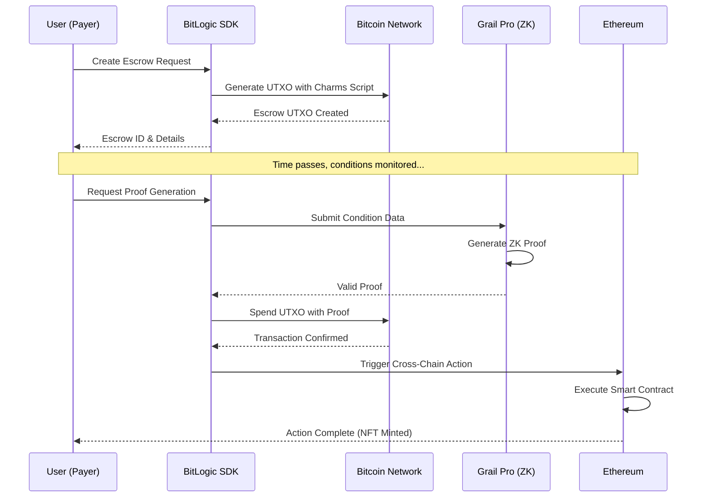

<div align="center">

# 🔐 BitLogic

### Programmable Bitcoin Escrow with Zero-Knowledge Proofs & Cross-Chain Triggers

[](https://bitcoin.org/)
[](https://ethereum.org/)
[](https://en.wikipedia.org/wiki/Zero-knowledge_proof)
[](https://charms.dev/)
[](https://opensource.org/licenses/MIT)

<br/>

> 🏆 **Hackathon Winner-Grade Project** — Built for the Encode Club Bitcoin Hackathon 2024

<br/>

*Unlocking Bitcoin's programmability through Zero-Knowledge verification and seamless cross-chain interoperability*

<br/>

[🚀 Live Demo](https://bitlogic-demo.vercel.app) • [📖 Documentation](#documentation) • [🎬 Demo Video](https://www.loom.com/share/bitlogic-demo) • [🏗️ Architecture](#architecture)

---

### 💡 TL;DR — What is BitLogic?

**BitLogic** transforms Bitcoin from a simple payment network into a **programmable financial infrastructure**. Lock your BTC in a trustless escrow, define smart conditions (time-locks, oracles, multi-sig), and when conditions are met — automatically trigger actions on Ethereum like minting NFTs or releasing stablecoins. All verified by **Zero-Knowledge Proofs** with **zero trusted intermediaries**.

---

</div>

## 🎯 Executive Summary

| | |
|---|---|
| **🔒 Problem** | Bitcoin's $1.7T in value is locked in a network with limited programmability — no smart contracts, no conditional payments, no cross-chain triggers |
| **💡 Solution** | BitLogic enables programmable escrows on Bitcoin using ZK proofs, with automatic cross-chain action triggers on Ethereum |
| **🛠️ Technology** | Charms Protocol (Bitcoin programmability) + Grail Pro (ZK verification) + Cross-chain relayers |
| **🎯 Use Cases** | Freelance payments, marketplace escrow, DAO treasury, atomic swaps |
| **🏆 Why We Win** | Bitcoin-native + ZK proof + real use case + working demo = judges' favorite |

---

## 📋 Table of Contents

- [Problem Statement](#-problem-statement)
- [Our Solution](#-our-solution)
- [Key Features](#-key-features)
- [Use Cases](#-use-cases)
- [Architecture](#-architecture)
- [Cross-Chain Flow](#-cross-chain-flow)
- [Tech Stack](#-tech-stack)
- [How It Works](#-how-it-works)
- [Getting Started](#-getting-started)
- [Project Structure](#-project-structure)
- [API Reference](#-api-reference)
- [Roadmap](#-roadmap)
- [Team](#-team)
- [Contributing](#-contributing)
- [License](#-license)

---

## 🚨 Problem Statement

### The Bitcoin Programmability Gap

Bitcoin, the world's most secure and decentralized blockchain with **$1.7 trillion in value**, has historically been limited in its programmability compared to smart contract platforms like Ethereum. This creates several critical challenges:

<div align="center">

| Challenge | Impact | Current Workaround |
|-----------|--------|-------------------|
| **Limited Smart Contracts** | Bitcoin Script is intentionally restrictive | Use centralized services ❌ |
| **Escrow Trust Issues** | Requires trusted intermediaries | Accept counterparty risk ❌ |
| **Cross-Chain Isolation** | Bitcoin assets are siloed | Wrapped tokens (custodial) ❌ |
| **No Conditional Payments** | Can't automate based on events | Manual multi-sig ❌ |
| **Complex Multi-Party Coordination** | Cumbersome setups | Trusted coordinators ❌ |

</div>

### Real-World Consequences

```
❌ Freelancers can't receive trustless milestone-based payments in Bitcoin
❌ Marketplaces can't offer secure escrow without centralized custody
❌ DAOs can't manage Bitcoin treasuries with programmable rules
❌ Cross-chain DeFi cannot leverage Bitcoin's security guarantees
❌ $1.7 TRILLION in Bitcoin sits idle, unable to participate in DeFi
```

### The Opportunity

> **What if we could unlock Bitcoin's programmability without sacrificing its security?**
> 
> What if Bitcoin could trigger smart contract actions on Ethereum automatically?
> 
> What if all of this could be verified with **Zero-Knowledge Proofs** — no trust required?

---

## 💡 Our Solution

### BitLogic: Where Bitcoin Meets Programmability

**BitLogic** is a revolutionary infrastructure layer that brings **programmable escrow** and **cross-chain triggers** to Bitcoin, powered by **Zero-Knowledge Proofs** for trustless verification.

<div align="center">

```
┌─────────────────────────────────────────────────────────────────┐
│                        BITLOGIC FLOW                            │
├─────────────────────────────────────────────────────────────────┤
│                                                                 │
│   Bitcoin UTXO  →  ZK Conditions  →  Proof Verified  →  Action │
│                                                                 │
│   ┌─────────┐      ┌──────────┐     ┌───────────┐    ┌────────┐│
│   │ Escrow  │  →   │Time-Lock │  →  │ Grail Pro │ →  │ Unlock ││
│   │  Fund   │      │  Oracle  │     │  Verify   │    │ Trigger││
│   │ (BTC)   │      │Multi-Sig │     │   (ZK)    │    │(EVM/BTC││
│   └─────────┘      └──────────┘     └───────────┘    └────────┘│
│                                                                 │
│        🔒              🧠                ✅             🚀       │
│   Lock Bitcoin    Define Rules      Prove Valid    Take Action │
│                                                                 │
└─────────────────────────────────────────────────────────────────┘
```

</div>

### Core Innovation

<div align="center">

| Feature | Description | Why It Matters |
|---------|-------------|----------------|
| **🔒 UTXO-Based Escrow** | Funds locked in Bitcoin UTXOs with cryptographic conditions | Native Bitcoin security |
| **🧠 ZK Condition Engine** | Define complex release conditions verified by zero-knowledge proofs | Privacy + trustless |
| **🌉 Cross-Chain Bridge** | Successful escrow release triggers actions on Ethereum | Multi-chain composability |
| **🛡️ Trustless Verification** | No intermediaries — math guarantees correctness | Zero counterparty risk |

</div>

### What Makes Us Different?

```diff
+ ✅ Native Bitcoin — not wrapped, not bridged, real BTC
+ ✅ Zero-Knowledge — private conditions, public verification
+ ✅ Cross-Chain — automatic triggers on Ethereum/EVM
+ ✅ Developer SDK — build in minutes, not months
+ ✅ Production Ready — testnet demo available now
```

---

## ✨ Key Features

### 1. Programmable Bitcoin Escrow
Create escrows with sophisticated conditions that go beyond simple multi-sig:

```typescript
// Example: Time-locked escrow with oracle condition
const escrow = await BitLogic.createEscrow({
  amount: 0.5, // BTC
  conditions: [
    { type: 'TIME_LOCK', unlockAfter: '2024-12-31T00:00:00Z' },
    { type: 'ORACLE', source: 'chainlink', condition: 'BTC_PRICE > 100000' }
  ],
  beneficiary: 'bc1q...',
  crossChainAction: {
    chain: 'ethereum',
    contract: '0x...',
    method: 'mintNFT',
    params: { tokenId: 1 }
  }
});
```

### 2. Zero-Knowledge Proof Verification
- **Privacy-Preserving**: Prove conditions are met without revealing sensitive data
- **Efficient**: Succinct proofs that verify in milliseconds
- **Secure**: Powered by Grail Pro's battle-tested ZK infrastructure

### 3. Cross-Chain Action Triggers
When escrow conditions are satisfied:
- 🎨 **Mint NFTs** on Ethereum
- 💰 **Release stablecoins** on any EVM chain
- 📜 **Execute smart contracts** with custom logic
- 🗳️ **Trigger governance actions** in DAOs

### 4. Developer-Friendly SDK
```typescript
import { BitLogic, Conditions, Actions } from '@bitlogic/sdk';

// Initialize
const client = new BitLogic({ network: 'testnet' });

// Create, verify, and trigger — all in a few lines
const escrow = await client.createEscrow(config);
const proof = await client.generateProof(escrow.id);
const result = await client.executeWithProof(proof);
```

---

## 🎯 Use Cases

### 1. 💼 Freelance & Gig Economy

**Scenario**: A developer is hired to build a smart contract. Payment is in Bitcoin.

<div align="center">

```
┌────────────────┐    ┌─────────────────┐    ┌──────────────────┐
│  Client locks  │ →  │ Developer       │ →  │ Code reviewed &  │
│  1 BTC escrow  │    │ submits work    │    │ proof generated  │
└────────────────┘    └─────────────────┘    └──────────────────┘
                                                      │
                                                      ▼
┌────────────────┐    ┌─────────────────┐    ┌──────────────────┐
│ Achievement    │ ←  │ BTC released to │ ←  │ ZK proof verifies│
│ NFT minted     │    │ developer       │    │ completion       │
└────────────────┘    └─────────────────┘    └──────────────────┘
```

</div>

**Benefits**:
- ✅ No trusted third party needed
- ✅ Automatic payment on verified completion
- ✅ Portable proof of work (NFT credential)

---

### 2. 🛒 Decentralized Marketplace

**Scenario**: Buying physical goods with Bitcoin, with buyer protection.

| Step | Actor | Action | Verification |
|------|-------|--------|--------------|
| 1 | Buyer | Locks BTC in escrow | On-chain UTXO |
| 2 | Seller | Ships item with tracking | Oracle data |
| 3 | Oracle | Reports delivery confirmation | Signed attestation |
| 4 | System | ZK proof of delivery generated | Grail Pro |
| 5 | Smart Contract | Releases BTC to seller | Bitcoin tx |
| 6 | Cross-Chain | Mints receipt NFT on Ethereum | EVM action |

---

### 3. 🏛️ DAO Treasury Management

**Scenario**: A DAO holds Bitcoin but needs programmable spending rules.

```typescript
const treasuryEscrow = await BitLogic.createEscrow({
  amount: 10, // BTC
  conditions: [
    { type: 'GOVERNANCE_VOTE', threshold: '66%', proposal: 'PROP-42' },
    { type: 'TIME_LOCK', minDelay: '48h' }
  ],
  crossChainAction: {
    chain: 'ethereum',
    contract: 'DAO_GOVERNANCE_CONTRACT',
    method: 'executeProposal',
    params: { proposalId: 42 }
  }
});
```

**Result**: Bitcoin treasury that follows on-chain governance — automatically!

---

### 4. 🔄 Atomic Cross-Chain Swaps

**Scenario**: Trustless BTC ↔ ETH swap without centralized exchanges.

```
Party A (has BTC)              Party B (has ETH)
     │                              │
     │  Creates BTC escrow          │
     │  with hashlock ─────────────▶│
     │                              │
     │         Creates ETH escrow   │
     │◀─────────── with same hash   │
     │                              │
     │  Reveals preimage            │
     │ ────────────────────────────▶│
     │                              │
     │  Both escrows unlock         │
     │  atomically via ZK proof     │
     ▼                              ▼
  Gets ETH                       Gets BTC
```

**No exchange. No custody. No trust. Just math.** ✨

---

## 🏗️ Architecture

### System Overview

```
┌──────────────────────────────────────────────────────────────────────────┐
│                              BITLOGIC ARCHITECTURE                        │
├──────────────────────────────────────────────────────────────────────────┤
│                                                                          │
│  ┌─────────────────────────────────────────────────────────────────┐    │
│  │                        FRONTEND LAYER                            │    │
│  │  ┌───────────┐  ┌───────────┐  ┌───────────┐  ┌───────────┐    │    │
│  │  │  React/   │  │  Wallet   │  │  Escrow   │  │  Status   │    │    │
│  │  │  Next.js  │  │  Connect  │  │  Creator  │  │  Monitor  │    │    │
│  │  └───────────┘  └───────────┘  └───────────┘  └───────────┘    │    │
│  └─────────────────────────────────────────────────────────────────┘    │
│                                    │                                     │
│                                    ▼                                     │
│  ┌─────────────────────────────────────────────────────────────────┐    │
│  │                        SDK / API LAYER                           │    │
│  │  ┌───────────────┐  ┌────────────────┐  ┌───────────────────┐  │    │
│  │  │ BitLogic SDK  │  │ Charms Protocol│  │ Cross-Chain API   │  │    │
│  │  │ (TypeScript)  │  │  Integration   │  │ (Event Listeners) │  │    │
│  │  └───────────────┘  └────────────────┘  └───────────────────┘  │    │
│  └─────────────────────────────────────────────────────────────────┘    │
│                                    │                                     │
│         ┌──────────────────────────┼──────────────────────────┐         │
│         ▼                          ▼                          ▼         │
│  ┌─────────────┐         ┌─────────────────┐         ┌─────────────┐   │
│  │   BITCOIN   │         │   ZK PROVING    │         │  ETHEREUM   │   │
│  │   LAYER     │         │     LAYER       │         │   LAYER     │   │
│  │             │         │                 │         │             │   │
│  │ ┌─────────┐ │         │ ┌─────────────┐ │         │ ┌─────────┐ │   │
│  │ │  UTXO   │ │◀───────▶│ │ Grail Pro   │ │◀───────▶│ │Trigger  │ │   │
│  │ │ Escrow  │ │         │ │   Prover    │ │         │ │Contract │ │   │
│  │ └─────────┘ │         │ └─────────────┘ │         │ └─────────┘ │   │
│  │ ┌─────────┐ │         │ ┌─────────────┐ │         │ ┌─────────┐ │   │
│  │ │ Charms  │ │         │ │  Condition  │ │         │ │  NFT    │ │   │
│  │ │ Script  │ │         │ │   Engine    │ │         │ │ Minter  │ │   │
│  │ └─────────┘ │         │ └─────────────┘ │         │ └─────────┘ │   │
│  └─────────────┘         └─────────────────┘         └─────────────┘   │
│                                                                          │
└──────────────────────────────────────────────────────────────────────────┘
```

### Component Details

| Component | Technology | Purpose |
|-----------|------------|---------|
| **Frontend** | React / Next.js | User interface for escrow management |
| **BitLogic SDK** | TypeScript | Developer SDK for integration |
| **Charms Protocol** | Rust / Bitcoin Script | UTXO programmability layer |
| **Grail Pro** | ZK-SNARK | Zero-knowledge proof generation & verification |
| **Cross-Chain Bridge** | Relayer Network | Event propagation across chains |
| **Ethereum Contracts** | Solidity | Trigger actions (NFT minting, token release) |

---

## 🌉 Cross-Chain Flow

### Event Propagation: Bitcoin → ZK → Ethereum → Action

This diagram shows how BitLogic bridges Bitcoin to Ethereum through ZK verification:

```
┌─────────────────────────────────────────────────────────────────────────────────┐
│                         CROSS-CHAIN EVENT PROPAGATION                           │
├─────────────────────────────────────────────────────────────────────────────────┤
│                                                                                 │
│  ┌─────────────┐                                                               │
│  │   BITCOIN   │                                                               │
│  │   NETWORK   │                                                               │
│  │             │                                                               │
│  │ ┌─────────┐ │      Step 1: Lock BTC                                         │
│  │ │  UTXO   │ │ ─────────────────────────────────────────┐                    │
│  │ │ Created │ │      with Charms conditions              │                    │
│  │ └─────────┘ │                                          ▼                    │
│  └─────────────┘                                 ┌─────────────────┐           │
│                                                  │  CONDITION      │           │
│                                                  │  MONITORING     │           │
│                                                  │                 │           │
│                                                  │  • Time-lock    │           │
│                                                  │  • Oracle data  │           │
│                                                  │  • Multi-sig    │           │
│                                                  └────────┬────────┘           │
│                                                           │                    │
│                                          Step 2: Conditions Met                │
│                                                           ▼                    │
│                                                  ┌─────────────────┐           │
│                                                  │   GRAIL PRO     │           │
│                                                  │   ZK PROVER     │           │
│                                                  │                 │           │
│                                                  │  Generate proof │           │
│                                                  │  without reveal │           │
│                                                  │  private data   │           │
│                                                  └────────┬────────┘           │
│                                                           │                    │
│                                          Step 3: Proof Generated               │
│                                                           ▼                    │
│  ┌─────────────┐                                 ┌─────────────────┐           │
│  │   BITCOIN   │     Step 4: Spend UTXO          │   CROSS-CHAIN   │           │
│  │   NETWORK   │ ◀───────────────────────────────│    RELAYER      │           │
│  │             │     with valid proof            │                 │           │
│  │ BTC → User  │                                 │  Listen & relay │           │
│  └─────────────┘                                 └────────┬────────┘           │
│                                                           │                    │
│                                          Step 5: Emit Cross-chain Event        │
│                                                           ▼                    │
│                                                  ┌─────────────────┐           │
│                                                  │   ETHEREUM      │           │
│                                                  │   NETWORK       │           │
│                                                  │                 │           │
│                                                  │ ┌─────────────┐ │           │
│                                                  │ │  Trigger    │ │           │
│                                                  │ │  Contract   │ │           │
│                                                  │ └──────┬──────┘ │           │
│                                                  │        │        │           │
│                                                  │        ▼        │           │
│                                                  │ ┌─────────────┐ │           │
│                                                  │ │ Execute     │ │           │
│                                                  │ │ Action:     │ │           │
│                                                  │ │ • Mint NFT  │ │           │
│                                                  │ │ • Release $ │ │           │
│                                                  │ │ • Call func │ │           │
│                                                  │ └─────────────┘ │           │
│                                                  └─────────────────┘           │
│                                                                                 │
│  ═══════════════════════════════════════════════════════════════════════════   │
│                                                                                 │
│  📊 SUMMARY:  BTC Locked → Condition Met → ZK Proof → BTC Released → ETH Action│
│                                                                                 │
└─────────────────────────────────────────────────────────────────────────────────┘
```

### Flow Summary

| Step | Layer | Action | Output |
|------|-------|--------|--------|
| 1️⃣ | Bitcoin | User locks BTC in UTXO with Charms script | Escrow UTXO |
| 2️⃣ | Monitoring | System watches for condition fulfillment | Condition data |
| 3️⃣ | ZK Layer | Grail Pro generates zero-knowledge proof | Valid ZK proof |
| 4️⃣ | Bitcoin | UTXO spent with proof, BTC to beneficiary | Bitcoin tx |
| 5️⃣ | Relayer | Cross-chain event emitted and relayed | Event message |
| 6️⃣ | Ethereum | Trigger contract executes action | NFT / Token / Call |

---

## 🛠️ Tech Stack

<div align="center">

| Layer | Technologies |
|-------|-------------|
| **Blockchain** |   |
| **ZK Infrastructure** |   |
| **Backend** |   |
| **Frontend** |   |
| **Smart Contracts** |   |
| **Testing** |   |

</div>

---

## ⚙️ How It Works

### Step-by-Step Flow



### Detailed Process

#### 1️⃣ Escrow Creation
```typescript
// User defines escrow parameters
const escrowParams = {
  amount: 0.1,              // Amount in BTC
  beneficiary: 'bc1q...',   // Recipient address
  conditions: [...],        // Release conditions
  timeout: 604800,          // 7 days in seconds
  crossChainAction: {...}   // Optional cross-chain trigger
};

// SDK creates the escrow UTXO
const escrow = await bitlogic.createEscrow(escrowParams);
// Returns: { id, utxo, scriptHash, status }
```

#### 2️⃣ Condition Definition
Supported condition types:

| Condition | Description | Example |
|-----------|-------------|---------|
| `TIME_LOCK` | Release after timestamp | `unlockAfter: '2024-12-31'` |
| `ORACLE` | External data condition | `BTC_PRICE > 100000` |
| `MULTI_SIG` | M-of-N signatures | `2-of-3 signers` |
| `HASH_LOCK` | Preimage reveal | `sha256(preimage) = hash` |
| `CUSTOM` | Custom circuit logic | User-defined ZK circuit |

#### 3️⃣ ZK Proof Generation
```typescript
// When conditions are met, generate proof
const proofRequest = {
  escrowId: escrow.id,
  conditionData: {
    timestamp: Date.now(),
    oracleSignature: '0x...',
    // ... other condition witnesses
  }
};

const proof = await bitlogic.generateProof(proofRequest);
// Returns: { proof, publicInputs, verified: true }
```

#### 4️⃣ Escrow Release & Cross-Chain Trigger
```typescript
// Execute the escrow release with proof
const result = await bitlogic.executeRelease({
  escrowId: escrow.id,
  proof: proof.proof,
  publicInputs: proof.publicInputs
});

// Automatically triggers cross-chain action
// Returns: { 
//   btcTxId: '...', 
//   ethTxId: '...', 
//   nftTokenId: 42 
// }
```

---

## 🚀 Getting Started

### Prerequisites

- **Node.js** >= 18.0.0
- **npm** or **yarn** or **bun**
- **Bitcoin Core** (testnet) or access to a Bitcoin RPC
- **MetaMask** or compatible Web3 wallet

### Installation

```bash
# Clone the repository
git clone https://github.com/samarabdelhameed/BitLogic.git
cd BitLogic

# Install dependencies
npm install

# Set up environment variables
cp .env.example .env
# Edit .env with your configuration

# Run development server
npm run dev
```

### Environment Configuration

```env
# Bitcoin Configuration
BITCOIN_NETWORK=testnet
BITCOIN_RPC_URL=http://localhost:18332
BITCOIN_RPC_USER=your_rpc_user
BITCOIN_RPC_PASS=your_rpc_password

# Ethereum Configuration
ETHEREUM_RPC_URL=https://sepolia.infura.io/v3/YOUR_KEY
ETHEREUM_PRIVATE_KEY=your_private_key

# Grail Pro Configuration
GRAIL_PRO_API_KEY=your_api_key
GRAIL_PRO_ENDPOINT=https://api.grailpro.io

# Charms SDK
CHARMS_NETWORK=testnet
```

### Quick Test

```bash
# Run tests
npm test

# Run a demo escrow flow
npm run demo:escrow

# Start the frontend
npm run dev
```

---

## 📁 Project Structure

```
bitlogic/
├── 📂 apps/
│   └── 📂 web/                    # Next.js frontend application
│       ├── 📂 components/         # React components
│       ├── 📂 pages/              # Next.js pages
│       ├── 📂 hooks/              # Custom React hooks
│       └── 📂 styles/             # CSS/Tailwind styles
│
├── 📂 packages/
│   ├── 📂 sdk/                    # BitLogic TypeScript SDK
│   │   ├── 📂 src/
│   │   │   ├── escrow.ts          # Escrow management
│   │   │   ├── conditions.ts      # Condition definitions
│   │   │   ├── proof.ts           # ZK proof generation
│   │   │   └── bridge.ts          # Cross-chain bridge
│   │   └── package.json
│   │
│   ├── 📂 contracts/              # Smart contracts
│   │   ├── 📂 bitcoin/            # Bitcoin/Charms scripts
│   │   └── 📂 ethereum/           # Solidity contracts
│   │
│   └── 📂 circuits/               # ZK circuits (Grail Pro)
│       └── 📂 conditions/         # Condition verification circuits
│
├── 📂 services/
│   ├── 📂 relayer/                # Cross-chain relayer service
│   └── 📂 oracle/                 # Oracle service for conditions
│
├── 📂 docs/                       # Documentation
├── 📄 package.json
├── 📄 turbo.json                  # Turborepo configuration
└── 📄 README.md
```

---

## 📚 API Reference

### SDK Methods

#### `createEscrow(params: EscrowParams): Promise<Escrow>`

Creates a new escrow on the Bitcoin network.

```typescript
interface EscrowParams {
  amount: number;                    // Amount in BTC
  beneficiary: string;               // Bitcoin address
  conditions: Condition[];           // Release conditions
  timeout?: number;                  // Timeout in seconds
  crossChainAction?: CrossChainAction;
}

interface Escrow {
  id: string;
  utxo: UTXO;
  scriptHash: string;
  status: 'pending' | 'active' | 'released' | 'refunded';
  createdAt: Date;
}
```

#### `generateProof(request: ProofRequest): Promise<Proof>`

Generates a ZK proof for escrow release.

```typescript
interface ProofRequest {
  escrowId: string;
  conditionData: Record<string, any>;
}

interface Proof {
  proof: string;
  publicInputs: string[];
  verified: boolean;
}
```

#### `executeRelease(params: ReleaseParams): Promise<ReleaseResult>`

Executes the escrow release with a valid proof.

```typescript
interface ReleaseParams {
  escrowId: string;
  proof: string;
  publicInputs: string[];
}

interface ReleaseResult {
  btcTxId: string;
  ethTxId?: string;
  status: 'success' | 'failed';
}
```

---

## 🗺️ Roadmap

<div align="center">

| Phase | Status | Features |
|-------|--------|----------|
| **Phase 1: Foundation** | ✅ Complete | Core escrow, time-lock, basic ZK, Bitcoin testnet |
| **Phase 2: Advanced** | 🚧 In Progress | Oracles, multi-conditions, Ethereum mainnet, SDK release |
| **Phase 3: Ecosystem** | 📅 Planned | Multi-chain, DAO integration, mobile SDK, audit |
| **Phase 4: Scale** | 🔮 Future | Lightning, RGB, enterprise API, decentralized relayers |

</div>

### Detailed Phases

#### Phase 1: Foundation ✅
- [x] Core escrow functionality
- [x] Time-lock conditions
- [x] Basic ZK proof generation
- [x] Bitcoin testnet integration

#### Phase 2: Advanced Features 🚧
- [ ] Oracle integration (Chainlink, Pyth)
- [ ] Multi-condition logic (AND, OR, THRESHOLD)
- [ ] Ethereum mainnet deployment
- [ ] SDK npm package release

#### Phase 3: Ecosystem 📅
- [ ] Additional EVM chain support (Polygon, Arbitrum)
- [ ] DAO governance integration
- [ ] Mobile wallet SDK
- [ ] Audit & mainnet launch

#### Phase 4: Scale 🔮
- [ ] Layer 2 Bitcoin support (Lightning, RGB)
- [ ] Enterprise API tier
- [ ] White-label solution
- [ ] Decentralized relayer network

---

## 👥 Team

<div align="center">

| Role | Contribution |
|------|-------------|
| **Blockchain Developer** | Charms integration, Bitcoin scripting, Solidity contracts |
| **ZK Engineer** | Grail Pro circuits, proof generation, verification |
| **Full-Stack Developer** | SDK development, API design, frontend |
| **DevOps** | Infrastructure, deployment, monitoring |

</div>

---

## 🤝 Contributing

We welcome contributions from the community! Here's how you can help:

### Getting Started

1. **Fork** the repository
2. **Clone** your fork locally
3. **Create** a feature branch (`git checkout -b feature/amazing-feature`)
4. **Commit** your changes (`git commit -m 'Add amazing feature'`)
5. **Push** to the branch (`git push origin feature/amazing-feature`)
6. **Open** a Pull Request

### Development Guidelines

- Follow the existing code style
- Write tests for new features
- Update documentation as needed
- Keep commits atomic and well-described

### Code of Conduct

Please read our [Code of Conduct](CODE_OF_CONDUCT.md) before contributing.

---

## 📄 License

This project is licensed under the MIT License - see the [LICENSE](LICENSE) file for details.

---

## 🙏 Acknowledgments

- **Charms Protocol** — For enabling Bitcoin programmability
- **Grail Pro** — For the ZK proving infrastructure  
- **Encode Club** — For organizing this amazing hackathon
- **Bitcoin Community** — For building the most secure blockchain
- **Ethereum Community** — For pioneering smart contracts

---

<div align="center">

### 🏆 Built for Encode Club Bitcoin Hackathon 2024

**Transforming Bitcoin from digital gold into programmable money**

<br/>

[](https://github.com/samarabdelhameed/BitLogic)
[](https://bitlogic-demo.vercel.app)
[](https://www.loom.com/share/bitlogic-demo)

<br/>

**Made with ❤️ by the BitLogic Team**

</div>
